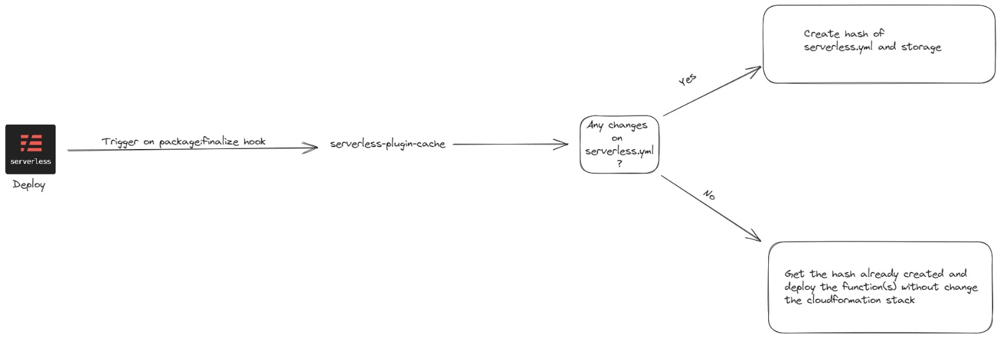

# serverless-cache-deploy

## This plugin caches serverless.yml and if there is no change in deploy,it just updates the function code



## Installation

### First install the plugin via npm.

```sh
npm install serverless-cache-deploy --save-dev
```
Then include the plugin within your serverless.yml config.
```yml
plugins:
  - serverless-cache-deploy
```

## Usage Example
custom.yml
```yml
cache:
  relativeUrl: ../exampleRelativeUrlToYourDir
```